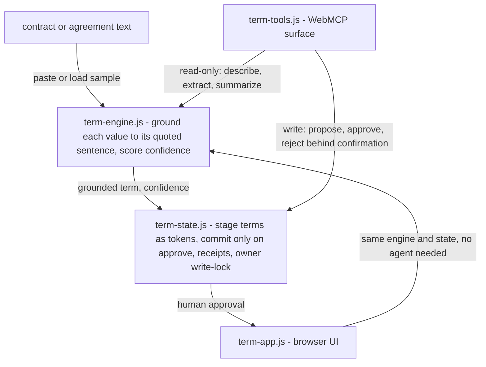

# TermLens

<p align="center">
  
</p>

Review a contract or agreement with your **agent**. TermLens lets an AI agent
read a document and propose the key terms (renewal date, termination, notice
period, payment, amounts, governing law, obligations, confidentiality,
non-compete, liability cap). Each proposed term is **grounded to the exact
sentence it came from** and confidence-scored, each term can be explained in
plain language, and nothing commits without your approval.

Because it exposes **WebMCP** tools, an agent in ChatGPT's in-app browser (or
Chrome with WebMCP enabled) can do the tedious extraction *with* you, in the same
page, while you stay in control of every committed term. It runs entirely in
your browser: no account, no server, no upload of the contract.

## Architecture

Four modules, one boundary. `term-engine.js` is pure grounding logic: if a
value is given it must appear in the quoted sentence, or the term is flagged
ungrounded. No DOM, no storage, no WebMCP. `term-state.js` owns the client
state and the human gate: terms are staged as tokens and only commit on
approval, with session receipts and an owner write-lock. `term-tools.js` is the
WebMCP surface, read-only by default. `term-app.js` is the browser UI and
mirrors the same engine and state, so a human can run the whole flow with no
agent.



## Why WebMCP is the right fit

Extracting terms from contracts is exactly the kind of task WebMCP targets: an
agent can call typed tools instead of guessing at the DOM, and a human can verify
each result before it's taken on faith.

- **Structured tools instead of UI guessing.** The agent calls `extract_terms`,
  `propose_term`, and `summarize_terms` with typed inputs, not by scraping and
  clicking.
- **Grounding, not "trust me bro."** Every proposed term carries the source
  quote it came from and a confidence score. If the value isn't actually in the
  contract, the term is marked **ungrounded and low-confidence**, so you know
  exactly where to look before you approve.
- **People and agents share one surface.** The agent extracts; the human approves,
  edits, or rejects each term. The agent can never silently commit.
- **Human-in-the-loop for anything that changes state.** `propose_term` stages a
  term and returns a token; `approve_term` commits it only after the human
  approves in the UI.
- **Read-only by default.** `describe_page`, `extract_terms`, and `summarize_terms`
  are marked `readOnlyHint: true`; only the propose/approve/reject tools mutate
  state, and only behind confirmation.

## The tools

| Tool | Read-only | What it does |
| --- | --- | --- |
| `describe_page` | yes | Whether a contract is loaded, its size, and term state |
| `extract_terms` | yes | Scans for candidate key terms with source quotes + confidence |
| `propose_term` | no | Stages one term, grounded to a source quote; returns a token |
| `propose_terms` | no | Stages several terms at once |
| `approve_term` | no | Commits a staged term after human approval |
| `reject_term` | no | Discards a staged term |
| `summarize_terms` | yes | Returns approved terms with their source quotes |
| `interpret_term` | yes | Explains what a proposed term means in plain language, for context, not legal advice |

## Verifiable by construction

- **Source attribution.** Every approved term stores the quote it was grounded
  to, so the review is auditable rather than taken on faith.
- **Confidence + grounding.** Low-confidence or ungrounded terms are flagged and
  visually warned so the human's attention goes where it's needed.
- **Session receipts.** Every tool call, human or agent, is logged as a receipt:
  tool, inputs, outcome. Export the log as JSON anytime.
- **Owner-controlled lock.** A "Lock committing" switch revokes the agent's
  ability to commit anything.

All local: the contract text, receipts, and approved terms stay in the browser
and are exportable, never uploaded.

## Run it locally

```bash
# from this folder
python -m http.server 8080
# open http://localhost:8080
```

To let an agent drive it from Chrome, enable the flag:

1. Visit `chrome://flags/#enable-webmcp-testing`
2. Set it to **Enabled** and relaunch.
3. Open the page, then use the Model Context Tool Inspector extension (or an
   agent in ChatGPT's in-app browser) to call the tools.

The page also works fully by hand: paste a contract, load the sample, and approve
or reject terms directly.

## Deploy

It is a static site. Deploy the folder to Cloudflare Pages, Vercel, Netlify,
GitHub Pages, or ChatGPT Sites. No build step, no backend. The `_headers` file
keeps the `tools` Permissions-Policy at its default (`self`) and origin
isolation intact, which WebMCP requires.

## License

MIT. See `LICENSE`.
