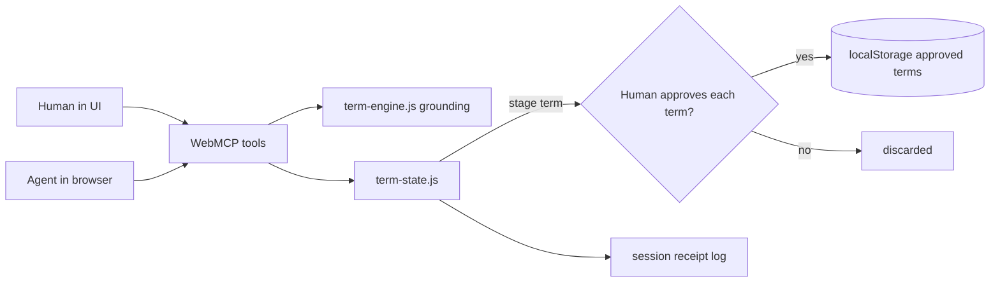

# Architecture

TermLens is a static, browser-only web app. There is no backend: the contract text
and approved terms live in the browser's `localStorage`, and the value comes from a
thin WebMCP tool surface that lets an AI agent propose terms a human approves.

## Modules

- `src/term-engine.js` - pure extraction/grounding logic. Given a contract and a
  term, it splits the text into sentences, scores how well a sentence supports the
  term's kind and value, and returns the best source quote plus a confidence score.
  The invariant: if a value is provided, it must appear in the quoted sentence for
  the term to be considered grounded at all. No DOM, no storage, no WebMCP.
- `src/term-state.js` - client-side state and the human gate. Holds the contract
  text, stages proposed terms as tokens that only commit on approve, keeps an
  owner-controlled write lock, and appends every tool call to a receipt log.
- `src/term-tools.js` - the WebMCP surface. Registers tools via
  `document.modelContext.registerTool`. Each tool wraps the engine and state;
  mutating tools are wrapped to check the write lock and log a receipt.
- `src/term-app.js` + `index.html` + `styles.css` - the UI. It renders staged and
  approved terms with their source quotes and confidence, and calls the same
  engine/state the agent does, so it is fully usable by a human without an agent.

## Data flow

The human and the agent meet at one boundary: the WebMCP tools. Both paths run the
same grounding logic, so a proposed term carries its source regardless of who asks.

## Human-in-the-loop gate

Committing is never a single call. `propose_term` stages a term and returns a
token; `approve_term` commits it only after the human approves in the UI. An owner
"Lock committing" switch revokes the agent's write access entirely. Every call,
human or agent, is written to a local receipt log that is exportable as JSON but
never uploaded. The agent can reason over the contract and propose terms, but it
cannot change your state without your explicit yes.

## WebMCP surface

Seven tools, each with a JSON `inputSchema` and `annotations`. Four are read-only
(`describe_page`, `extract_terms`, `summarize_terms`, and extract-style scans).
Three mutate state behind confirmation (`propose_term`, `approve_term`,
`reject_term`; plus `propose_terms` for batches). The split is what makes the app
safe to point an agent at a real contract.

## Privacy

No server, no account, no network calls. The contract never leaves the browser, and
every approved term is exportable as JSON. This is what makes handing an agent the
tools acceptable: the agent operates in the page, not on data we hold.
