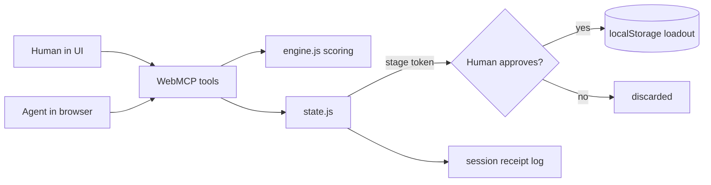

# Architecture

Coartifex is a static, browser-only web app. There is no backend: all player
data lives in the browser's `localStorage`, and the app's value comes from a thin
WebMCP tool surface that lets an AI agent drive the same logic a human uses.

## Modules

- `src/profiles.js` - game definitions. Ships HSR and Genshin profiles and accepts
  a pasted custom profile. A profile declares slots, substats, sets, and
  characters. The engine reads only the active profile, so a new game needs no code.
- `src/engine.js` - pure scoring. Given a profile, a relic, and a character, it
  scores the relic, suggests a per-slot build, plans a farm route, and does pity
  math. No DOM, no storage, no WebMCP. It is the single source of truth for advice.
- `src/state.js` - client-side state and the human gate. Holds the inventory and
  loadouts, stages a save as a token that only commits on confirm, keeps an
  owner-controlled write lock, and appends every tool call to a session receipt log.
- `src/tools.js` - the WebMCP surface. Registers seven tools via
  `document.modelContext.registerTool`. Each tool wraps the engine and state;
  mutating tools are wrapped to check the write lock and log a receipt.
- `src/app.js` + `index.html` + `styles.css` - the UI. It calls the same engine and
  state the agent does, so the app is fully usable by a human without an agent.

## Data flow

The human and the agent meet at one boundary: the WebMCP tools. Both paths run the
identical engine, so advice is consistent whether a person clicks or an agent calls.

## Human-in-the-loop gate

Saving is never a single call. `save_loadout` stages a change and returns a token;
`confirm_loadout` commits it only after the human approves in the UI. An owner
"Lock saving" switch revokes the agent's write access entirely. Every call, human
or agent, is written to a local receipt log that is exportable as JSON but never
uploaded. This is the agent-native pattern the project demonstrates: the agent can
reason over your data, but it cannot change your state without your explicit yes.

## WebMCP surface

Seven tools, each with a JSON `inputSchema` and `annotations`. Five are read-only
(`describe_game`, `evaluate_relic`, `suggest_build`, `plan_farm_route`,
`recommend_wishes`). Two mutate state behind confirmation (`save_loadout`,
`confirm_loadout`). The split is what makes the app safe to point an agent at.

## Privacy

No server, no account, no network calls. A player's relics never leave the browser.
This is what makes handing an agent the tools acceptable: the agent operates in the
page, not on data we hold.
